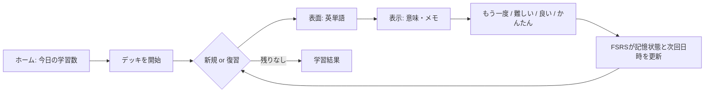
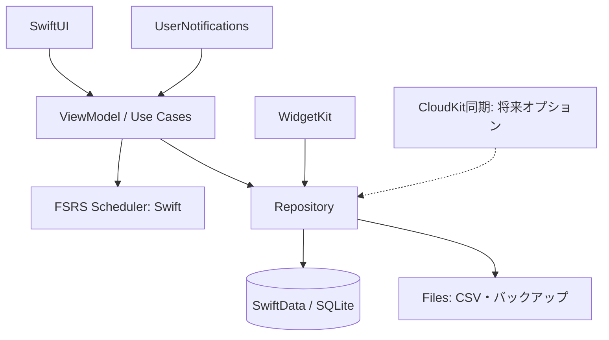

# LEAP対応・FSRS単語帳アプリ 設計書

- 文書バージョン: 0.1
- 作成日: 2026-08-13
- 対象: iPhone / iOS 17 以降
- 仮称: **LeapMemo**（公開前に商標調査・名称変更を実施）

## 1. 目的と前提

英単語を「思い出せたか」の回答履歴に応じて出題し、FSRS（Free Spaced Repetition Scheduler）で次回復習日時を個人最適化する、オフライン優先の単語帳アプリを作る。最初の教材候補は、ユーザー指定の「manabitagari」の「必携 英単語 LEAP（改訂版）」単語一覧である。

同ページは **LEAP改訂版** の単語・意味一覧であり、テスト作成・掲載語句のチェック用として案内されている。よって、初期デッキは「改訂版・同ページ掲載範囲のみ」を前提とし、例文・発音・アクセント・変化形・派生語・音声を無断で補完しない。

### 成功条件（MVP）

1. ユーザーがカードを学習し、**もう一度 / 難しい / 良い / かんたん** の日本語4段階で回答できる。
2. 回答直後に FSRS が次回復習日時とカード状態を決定する。
3. 今日の新規・復習件数、継続ドット、連続学習日数、正答傾向を確認できる。
4. データは端末内で利用でき、アカウントなしでも継続学習できる。
5. App Store 提出に必要なプライバシー情報、権利証跡、テスト、ストア素材を揃えられる。

## 2. 権利・コンテンツ方針（公開の必須ゲート）

指定ページは一覧のExcelコピーを案内している一方、学習用ではなくテスト作成・掲載語句のチェック用と案内している。LEAP本体の内容・名称等には別の権利者が存在し得る。ユーザーが書籍を所持していることは、単語・日本語訳・例文を不特定多数に再配布する許諾にはならない。

そのため、公開版で当該リストを同梱・配信する前に、次を満たすことをリリース判定の必須条件とする。

| 判定対象 | リリース前に必要なこと |
| --- | --- |
| 掲載元サイトの表 | manabitagari運営者から、iOSアプリへの複製・配信・商用利用の可否を文面で確認 |
| LEAP由来の単語選定・訳文・名称 | 出版社／権利者から、利用範囲（地域、期間、無料・有料、更新、表記）を許諾取得 |
| 例文・音声・表紙画像 | 個別に明示許諾を得る。得られない場合は同梱しない |
| App Store 表記 | アプリ名・説明・アイコンに第三者商標を使う場合は許諾を確認 |

**許諾が得られるまでの実装方針:** アプリは「自作カード／ユーザーが権利を持つCSVのローカル読込」に限定する。開発・デモ端末だけで、指定ページ由来のデータを検証用に扱う。公開用ビルドには含めない。Appleは、第三者の保護対象コンテンツを許可なく使用しないこと、第三者サービスのコンテンツ利用では利用規約上の許可を得ることを求めている。

## 3. 利用者と主要ユースケース

| 利用者 | 目的 | 主な操作 |
| --- | --- | --- |
| 学習者 | 毎日の暗記・復習 | デッキ選択、学習、日本語4段階評価、継続ドット・進捗確認 |
| 学習者 | 自分の教材を使う | CSVを端末に読込み、列の対応を確認してデッキ化 |
| 運営者（将来） | 許諾済み教材を配信 | コンテンツ版を登録、検証、公開・停止 |

### 学習フロー

## 4. 機能要件

### 4.1 MVPに含める

- デッキ一覧: 今日の復習数、新規数、総カード数、開始ボタン。
- 学習画面: 表面／裏面の切替、日本語4評価、各評価の予定間隔表示、スワイプではなく明示ボタンを基本にする。
- 出題: 期限切れ復習を優先し、その後に日次上限内の新規カードを提示。同日内の短期再学習も優先する。
- カード編集: 表面、裏面、メモ、タグ、停止（suspend）。
- CSV読込: UTF-8 CSV、`front,back,tags` を基本形式にし、重複・空欄・上書きを確認してから確定。
- 継続ドット: 直近13週（7行×13列）の学習日を、GitHubのコントリビューション表示のように色の濃さで可視化する。
- 統計: 当日、直近7/30日の回答数、正答率、期限超過数、連続学習日数。
- 設定: 目標保持率、日次新規上限、日次復習上限、タイムゾーン、通知、データ書出し。
- バックアップ: JSON/CSV形式の手動エクスポート／インポート。端末変更に備え、データは暗号化バックアップ対象にする。
- アクセシビリティ: Dynamic Type、VoiceOverラベル、十分なコントラスト、片手操作を考慮したボタン配置。

### 4.2 MVPから除外（次フェーズ）

- 複数端末同期、共同デッキ、ランキング／SNS。
- OCR、AI生成の例文・翻訳・会話機能。
- 音声・画像つき教材（権利と容量の設計を分ける）。
- Android版、Web版、課金。

## 5. UI設計

### 5.1 デザイン方針

- **一画面一目的:** ホームは「今日の学習を始める」、学習画面は「単語を答える」だけに集中させる。
- **余白と文字を主役にする:** 白または黒の単色背景、システムフォント、アクセント色は1色。装飾イラスト、常時表示のタブ、広告、学習中の外部リンクは使わない。
- **日本語で即決できる評価:** ボタンは `もう一度` `難しい` `良い` `かんたん` と表記し、下に「10分後」「3日後」のような予定間隔を添える。FSRSの英語Ratingは内部値にのみ使う。
- **操作は明示的に:** カードをタップして答えを表示し、下部の4ボタンで評価する。誤スワイプで回答しない。

### 5.2 継続ドット

ホーム上部に「学習の記録」を置く。直近91日を週単位で並べ、各日の復習・新規回答数に応じて丸いドットを4段階で表示する。

| ドット | 条件 | 表示 |
| --- | --- | --- |
| 0 | 回答なし | 薄いグレー |
| 1 | 1〜9回答 | 薄いアクセント色 |
| 2 | 10〜29回答 | 中間色 |
| 3 | 30回答以上 | 濃いアクセント色 |

今日のドットには輪郭をつける。各ドットは日付・回答数・新規数・復習数をVoiceOverで読めるようにし、タップでその日の内訳を表示する。GitHubのブランド、アイコン、名称は使用せず、継続状況をドットで可視化する表現のみを採用する。

さらに **WidgetKit** により、iPhoneホーム画面用の小・中サイズウィジェットを提供する。小は「今日の残り」と直近7日のドット、中は直近13週のドットと連続日数を表示する。タップ時はアプリの学習開始画面へ遷移する。ウィジェットはデータの表示のみで、カード評価は行わない。

| 画面 | 主な内容 | 遷移先 |
| --- | --- | --- |
| オンボーディング | 学習目的、通知、プライバシー、サンプルデッキ | ホーム |
| ホーム | 今日の復習、新規、継続ドット、連続日数、最小限のデッキ一覧 | 学習／統計／設定 |
| 学習 | 表面→回答表示→`もう一度 / 難しい / 良い / かんたん`、残数、終了 | 結果／カード詳細 |
| 結果 | 回答数、評価内訳、明日以降の見通し | ホーム |
| デッキ詳細 | カード一覧、検索、追加、CSV読込、設定 | 編集／学習 |
| 統計 | カレンダー、回答推移、カード状態別数 | なし |
| 設定 | FSRS、通知、データ、権利表示、問い合わせ | OS設定／共有シート |

ホームは「今日やるべきこと」を一番上に置き、その直下に継続ドット、最後にデッキ一覧を置く。学習中には設定・広告・外部リンクを出さない。カード面には単語、品詞、意味を分けて表示し、長い意味でも文字を切らない。

## 6. FSRS設計

### 6.1 採用方針

- アルゴリズムは **FSRSの固定バージョン** を採用する（実装開始時に正式なバージョンとパラメータ数をロックする）。
- FSRSはカードごとの Difficulty（難易度）、Stability（安定性）、Retrievability（想起確率）を用いて、指定の目標保持率を満たす次回間隔を計算する。
- 初回は公式既定パラメータで開始する。回答履歴が十分に集まったユーザーのみ、端末上または同意済みサーバー上で個人パラメータを最適化する。
- スケジューラはUIから独立した純粋関数として実装し、同じ入力なら必ず同じ出力になるようにする。

### 6.2 回答マッピングと状態

| 画面評価 | FSRS Rating | 意味 | 状態への影響 |
| --- | --- | --- |
| もう一度 | Again | 思い出せない | 再学習へ。短期ステップ後に再出題 |
| 難しい | Hard | 苦労して思い出した | 間隔を短くする |
| 良い | Good | 思い出せた | 標準の次回間隔 |
| かんたん | Easy | 余裕で思い出せた | より長い次回間隔 |

カード状態は `new / learning / review / relearning / suspended` とする。復習履歴には評価、回答日時、回答所要時間、回答前後の状態、算出された間隔とFSRSのスナップショットを保存する。これにより、将来のFSRS更新・不具合修正でも再現と移行が可能になる。

### 6.3 出題と制限

1. 期限切れの再学習
2. 期限切れの復習（期限が古い順）
3. 当日の新規（デッキの新規上限まで）

デフォルトは目標保持率 90%、新規20枚/日、復習は上限なし（任意設定可）。同日再学習の短期ステップはFSRS計算と別に定義し、例として Again のみ10分後に再提示する。数値は設定で明示し、リリース時に学習テストで調整する。

### 6.4 品質保証

- FSRS公式実装のテストベクトルを取り込み、全評価・全状態・日付境界で結果一致を検証する。
- タイムゾーン、夏時間、端末時計の変更、オフライン、連打、アプリ強制終了を自動テストする。
- パラメータ変更は、既存履歴を破壊せず「新設定適用日時」以後の予定再計算として扱う。

FSRS4Anki はスケジューラと、履歴から個人の記憶パターンに合うパラメータを見つけるオプティマイザで構成され、MITライセンスで公開されている。実装では利用するコード・仕様のライセンス表記を `Settings > Licenses` に掲載する。

## 7. 技術設計

### 7.1 構成

| 層 | 技術 | 責務 |
| --- | --- | --- |
| UI | SwiftUI | iPhoneネイティブ画面、アクセシビリティ、ローカライズ |
| アプリ状態 | Observation / MVVM | 画面状態、入力検証、Use Case呼出し |
| ドメイン | Swift | FSRS、出題順、統計、カード検証。外部SDKなし |
| 永続化 | SwiftData（SQLite） | カード、デッキ、履歴、設定、インポート記録 |
| 通知 | UserNotifications | 当日未学習・期限到来のローカル通知 |
| ホーム画面ウィジェット | WidgetKit / App Groups | 今日の残り、継続ドット、連続日数を表示 |
| 同期（v1.1） | CloudKit | ユーザーの私的DBのみを同期。教材配信は別系統 |

バックエンドなしでMVPをリリースできる。ログインも分析SDKも初期版には導入せず、データ最小化とApp Reviewの単純化を優先する。同期・教材配信・課金を導入する時点で、API、認証、削除請求、運用監視を別設計する。

## 8. データ設計

| エンティティ | 主な属性 | 備考 |
| --- | --- | --- |
| Deck | id, title, sourceType, sourceAttribution, contentVersion, limits, createdAt | `sourceType`: userImport / licensedCatalog / sample |
| Card | id, deckId, front, back, note, tags, state, dueAt, difficulty, stability, lastReviewAt, suspended | 表裏は将来の多言語対応を考えてテキスト型 |
| ReviewLog | id, cardId, reviewedAt, rating, elapsedMs, stateBefore, stateAfter, scheduledDays, dueBefore, dueAfter, fsrsVersion, parametersVersion | 追記専用 |
| SchedulerProfile | id, desiredRetention, weights, optimizedAt, algorithmVersion | デッキ共通ではなくユーザー単位を基本 |
| DailyStats | date, reviewedCount, newCount, againCount, learningSeconds | キャッシュ。履歴から再構築可能 |
| DailyActivity | date, totalAnswers, newAnswers, reviewAnswers, activityLevel | 継続ドットとWidgetKitの表示用。履歴から再構築可能 |
| ImportJob | id, filename, contentHash, importedAt, rowCount, skippedCount, sourceDeclaration | 再インポート判定・監査用 |

`Card` の次回予定とFSRS記憶状態は同一トランザクションで更新する。`ReviewLog` は削除・編集しない。教材データには出典、許諾ID、コンテンツ版を保持し、公開停止時に対象デッキを無効化できる設計にする。

## 9. 教材データ取込み設計

### 9.1 開発時の手順

1. 許諾確認前は、指定ページの改訂版単語・意味表を開発端末の検証データとしてのみ取り込む。
2. 行ごとに `sourceIndex / word / meaningRaw` を保存し、原文は加工前の監査用ファイルとして隔離する。
3. 空欄、重複語、表記ゆれ、HTML由来の文字化けを検査する。
4. 品詞ラベルと意味を分離したい場合も、意味を勝手に意訳・補足せず、原文と変換ルールを残す。
5. 許諾取得後にだけ、承認済みのコンテンツパッケージを署名・バージョン付きで配布用に生成する。

アプリ本体がWebページをスクレイピングする方式は採らない。コンテンツが予告なく変わる、利用規約や権利範囲を検証しにくい、オフライン利用に不向き、という理由による。

### 9.2 公開コンテンツの代替案

- 権利許諾済みのLEAP対応デッキを公式配信する。
- 利用者が自ら作成・保有するCSVだけを端末内にインポートする。
- 独自選定・独自訳文によるオリジナル英単語デッキを制作する。

## 10. セキュリティ・プライバシー

- MVPは氏名、メール、位置情報、広告ID、学習内容のサーバー送信を行わない。
- 端末内データはiOSのデータ保護を利用し、バックアップ出力は明示操作でのみ生成する。
- クラッシュ解析や分析を導入する場合は、送信項目を最小化し、App Privacyの申告とプライバシーポリシーを更新する。
- アカウント・CloudKit同期を導入したら、アプリ内からのデータ削除・エクスポートを提供する。
- 通知は初回説明後にOS権限を要求し、拒否しても全機能を利用可能にする。

## 11. テストと受入基準

| 区分 | 例 | 合格基準 |
| --- | --- | --- |
| Unit | FSRS入力→予定・状態、CSV解析、重複判定 | 公式テストベクトルと一致、境界値を網羅 |
| Integration | 回答→保存→再起動→次の出題 | 履歴・予定・統計に矛盾なし |
| UI | Dynamic Type最大、VoiceOver、ダークモード、継続ドット | 操作不能・欠け・意味不明なラベルなし |
| 実機 | iPhoneの主要画面サイズ、オフライン、通知、WidgetKit | クラッシュなし、通知の時刻・ウィジェット表示が設定と一致 |
| リリース | 初回起動、CSV読込、バックアップ復元 | レビュー担当者が説明なしでも主要導線を完了 |

受入時に「良いを選んだカードが連続して同じ日に通常復習として出ない」「もう一度は設定された短期ステップで再出題される」「端末再起動後も予定が保持される」「当日の回答数に応じて継続ドットとホーム画面ウィジェットが更新される」を必須確認項目とする。

## 12. App Store公開計画

### フェーズ

| フェーズ | 成果物 | 完了条件 |
| --- | --- | --- |
| 0: 権利確定 | 許諾書、教材台帳、名称調査 | 配信範囲と表記が文書化済み |
| 1: MVP | ローカル学習・FSRS・CSV・テスト | 実機で日常利用できる |
| 2: テスト配布 | TestFlight、フィードバック導線 | 20〜50人の学習データで安定性確認 |
| 3: 提出準備 | アイコン、スクリーンショット、説明文、Privacy Policy、App Privacy、レビュー用メモ | App Store Connectの必須項目を完了 |
| 4: 審査・公開 | リリース候補ビルド、審査対応 | 承認後に段階的リリース |
| 5: 継続運用 | 不具合修正、コンテンツ権利更新、サポート | 権利失効時は即時に配信停止可能 |

審査時には、ログインがあればテスト用アカウントまたはフル機能デモを提供し、非自明なFSRS評価・CSV読込・教材の権利状況をReview Notesで説明する。Appleは、クラッシュ・未完成状態を避け、メタデータを正確にし、アカウント機能がある場合には審査担当者へ完全なアクセスを提供するよう求めている。

## 13. 未決定事項と初回実装前の決定

1. 公開アプリにLEAP関連コンテンツを同梱するための、サイト運営者・権利者からの書面許諾を取得できるか。
2. アプリの正式名称、開発者名、対象地域、無料／有料モデル。
3. 初期版を「ログインなし・同期なし」で開始するか（本設計の推奨）。
4. iOS最小対応バージョン（本設計案は iOS 17）。
5. FSRSの採用バージョンと、公式テストベクトルを固定するコミット／リリース番号。

## 14. 参照

- [manabitagari: 「必携 英単語 LEAP（改訂版）」単語一覧](https://manabitagari.blog/archives/3106) — 改訂版の単語・意味一覧、テスト作成・掲載語句チェック用という案内を確認。
- [FSRS4Anki](https://github.com/open-spaced-repetition/fsrs4anki) — FSRSのスケジューラ／オプティマイザの位置づけ、MITライセンスを確認。
- [Apple App Review Guidelines](https://developer.apple.com/app-store/review/guidelines/) — 第三者コンテンツ、完全性、プライバシー、審査情報の要件を確認。
